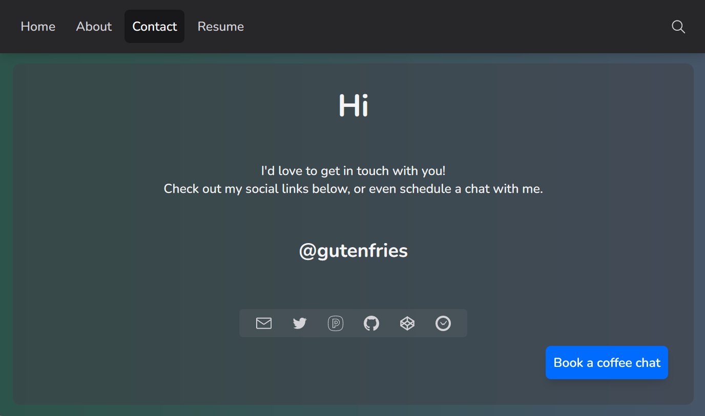

<!-- Improved compatibility of back-to-top link: -->

<a name="readme-top"></a>

<!--
*** Thanks for checking out gutenfries.deno.dev. If you have a suggestion
*** that would make this better, please fork the repo and create a pull request
*** or simply open an issue with the tag "enhancement".
*** Don't forget to give the project a star!
*** Thanks again! Now go create something AMAZING! :D
-->

[]()
[](https://github.com/gutenfries/gutenfries.deno.dev/graphs/contributors)
[](https://github.com/gutenfries/gutenfries.deno.dev/stargazers)
[](https://github.com/gutenfries/gutenfries.deno.dev/network/members)
[](https://github.com/gutenfries/gutenfries.deno.dev/issues)
[](https://github.com/gutenfries/gutenfries.deno.dev/blob/main/LICENSE.md)
[](https://github.com/gutenfries/gutenfries.deno.dev/actions/workflows/deno-tests.yml)
[](https://github.com/gutenfries/gutenfries.deno.dev/actions/workflows/rust-tests.yml)
[](https://fresh.deno.dev)

<!-- PROJECT LOGO -->
<br />
<div align="center">
	<a href="https://github.com/gutenfries/gutenfries.deno.dev">
		
	</a>
	<h1 align="center">gutenfries.deno.dev</h1>
	<p align="center">
	Welcome to the repository for my site!
		<br/>
		<br/>
		<a href="https://gutenfries.deno.dev">Production</a>
		·
		<a href="https://github.com/gutenfries/gutenfries.deno.dev/issues">Report Bug</a>
		·
		<a href="https://github.com/gutenfries/gutenfries.deno.dev/issues">Request Feature</a>
	</p>
</div>

<!-- TABLE OF CONTENTS -->
<details>
	<summary>Table of Contents</summary>
	<ol>
		<li>
			<a href="#getting-started">Getting Started</a>
			<ul>
				<li><a href="#built-with">Built With</a></li>
				<li><a href="#prerequisites">Prerequisites</a></li>
				<li><a href="#installation">Installation</a></li>
			</ul>
		</li>
		<li><a href="#usage">Usage</a></li>
		<li><a href="#roadmap">Roadmap</a></li>
		<li><a href="#contributing">Contributing</a></li>
		<li><a href="#license">License</a></li>
		<li><a href="#contact">Contact</a></li>
		<li><a href="#acknowledgments">Acknowledgments</a></li>
	</ol>
</details>

<!-- Overview -->

## Overview



<small>This is my website, built on <a href="https://fresh.deno.dev">Fresh</a>.</small>

<p align="right">(<a href="#readme-top">back to top</a>)</p>

### Built With

- [Deno](https://deno.land/) - A secure runtime for JavaScript and TypeScript
- [Deno Deploy](https://deno.com/deploy) (Deployment)
- [Fresh](https://fresh.deno.dev) (Deno framework)
- [Preact](https://preactjs.org/) (JSX Library)
- [Tailwind CSS](https://tailwindcss.com/) ([Twind](https://twind.dev/)) (Styling)
- [GitHub Actions](https://github.com/featuers/actions) (CI/CD)
- [Rust](https://www.rust-lang.org/) (wasm FFI)
  - [wasmbuild](https://github.com/denoland/wasmbuild) (wasm FFI tooling)

<p align="right">(<a href="#readme-top">back to top</a>)</p>

<!-- GETTING STARTED -->

## Getting Started

Go ahead and clone the repo if you would like to be involved in development.

### Prerequisites

The environment required to get rust working correctly for this use case can be quite tricky, especially on windows. With that said, these are the system prerequisites:

- [Rust](https://www.rust-lang.org/tools/install)

You may or may not already have rust installed on your system, but you need to have the nightly toolchain installed. You can check if you have it installed by running:

```sh
rustup toolchain list
```

If you do not have the nightly toolchain installed, you can install it by running:

```sh
rustup toolchain install nightly
```

If you need to install rust, you can do so by running:

```sh
curl -sSf https://sh.rustup.rs | sh -s -- -y --nightly-toolchain 1.65.0
export PATH="$PATH:/home/rust/.cargo/bin"
```

- [Deno](https://deno.land/manual/getting_started/installation)

Again, you may or may not already have deno installed on your system, You will need >v1.24.0 (v1.25.3 recommended) You can check if you have it installed by running:

```sh
deno --version
```

If you need to update deno, you can do so by running:

```sh
deno upgrade # will update to the latest stable version
```

If you do not have deno installed, you can install it by running:

```sh
curl -fsSL https://deno.land/x/install/install.sh | sh
```

### Installation

1. Clone the repo.

   ```sh
   git clone https://github.com/gutenfries/gutenfries.deno.dev.git
   ```

2. There is no step two. _No_ dependency installation. Rust and Deno are God-tier languages.

<p align="right">(<a href="#readme-top">back to top</a>)</p>

<!-- ROADMAP -->

## Roadmap :construction:

- ### Done
- [x] Modern gradient/glass card UI
- [x] Modern repository structure
- [x] CD with GitHub Actions & Deno Deploy
- [x] CI testing
- ### Partially Done
- [ ] Tests
  - [x] Typescript tests
  - [x] Rust tests
- [ ] JSX/Preact tests
- [ ] Search engine
- [ ] Resume page
- ### Planned
- [ ] SEO
- ### Potential
- [ ] Blog

See the [open issues](https://github.com/gutenfries/gutenfries.deno.dev/issues) for a full list of proposed features (and known issues).

<p align="right">(<a href="#readme-top">back to top</a>)</p>

<!-- CONTRIBUTING -->

## Contributing :handshake:

Contributions make the open source community such an amazing place to learn, inspire, and create. Any contributions you make are _**greatly appreciated**_.

If you have a suggestion that would make this better, please fork the repo and create a pull request. You can also simply open an issue with the tag "enhancement".
Don't forget to give the project a star! Thanks again!

1. Fork the Project
2. Create your Feature Branch (`git checkout -b feature/AmazingFeature`)
3. Commit your changes (`git commit -m 'Add some AmazingFeature'`)
4. Push to the Branch (`git push origin feature/AmazingFeature`)
5. Open a Pull Request

<p align="right">(<a href="#readme-top">back to top</a>)</p>

<!-- LICENSE -->

## License :page_facing_up:

Open sourced under the MIT License. See [LICENSE.md](https://github.com/gutenfries/gutenfries.deno.dev/blob/main/LICENSE.md) for more information.

<p align="right">(<a href="#readme-top">back to top</a>)</p>

<!-- CONTACT -->

## Contact :mailbox:

### Contributors :sparkles:

- Mark Gutenberger

  - :earth_americas: [gutenfries.deno.dev](https://gutenfries.deno.dev)
  <!-- - :bird: [@gutenfries](https://twitter.com/gutenfries) -->
  - :mailbox: [gutenfries@gmail.com](mailto:gutenfries@gmail.com)

<p align="right">(<a href="#readme-top">back to top</a>)</p>

<!-- ACKNOWLEDGMENTS -->

## Acknowledgments :pray:

Helpful resources used to get this project off the ground:

- [Best-README-Template](https://github.com/othneildrew/Best-README-Template)
- [Octo Icons](https://primer.style/octicons/)
- [Fresh docs](https://fresh.deno.dev/docs)
- [Preact docs](https://preactjs.com/guide/v10/getting-started)
- [Deno docs](https://deno.land/manual)
- [Deno Deploy docs](https://deno.com/deploy/docs)
- [Rust docs](https://doc.rust-lang.org/book/)
- [wasmbuild repo](https://github.com/denoland/wasmbuild/docs)

<p align="right">(<a href="#readme-top">back to top</a>)</p>
